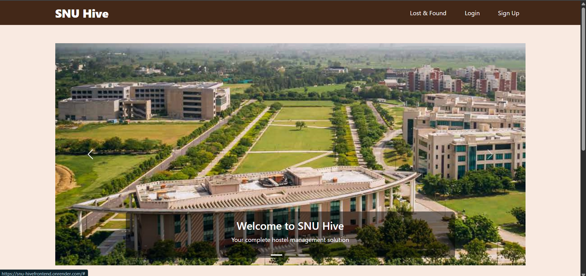
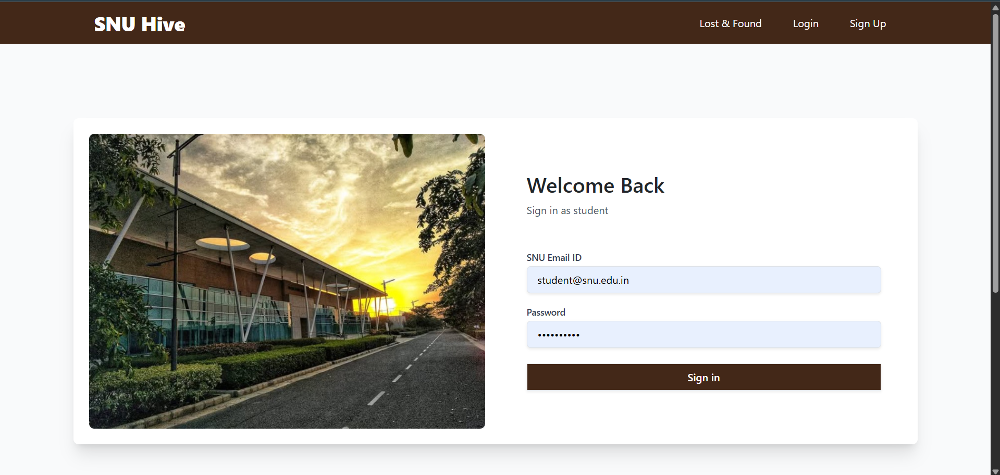
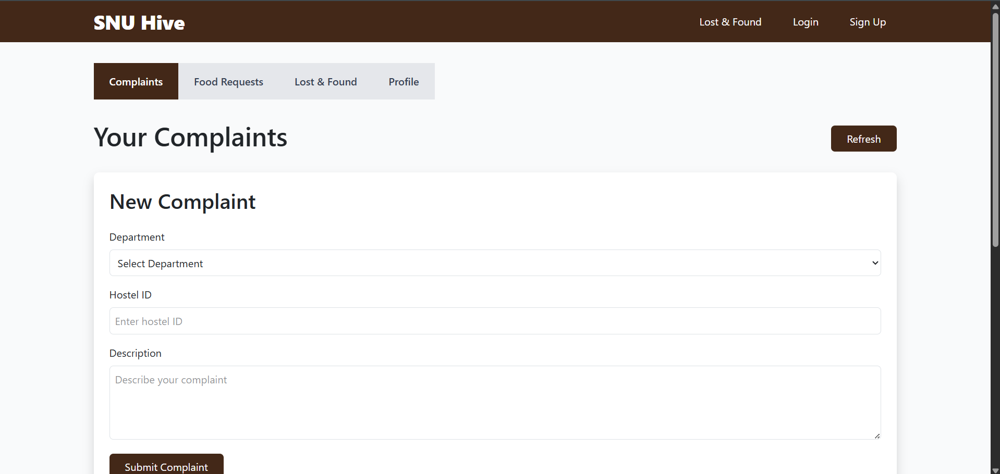
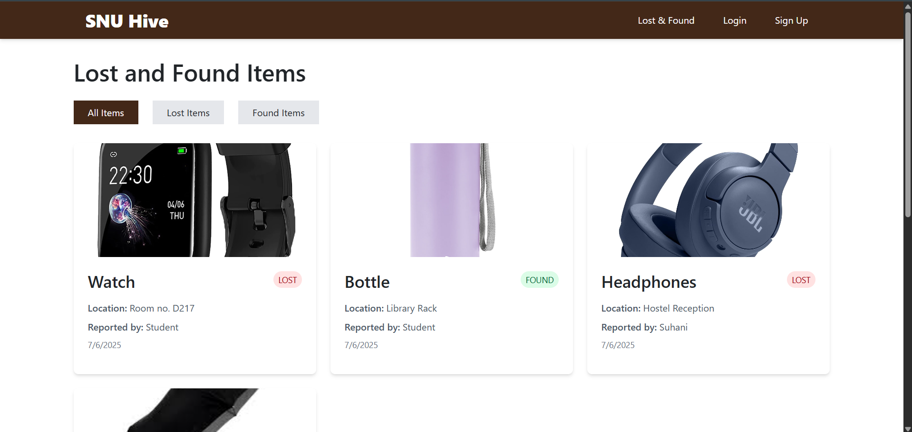
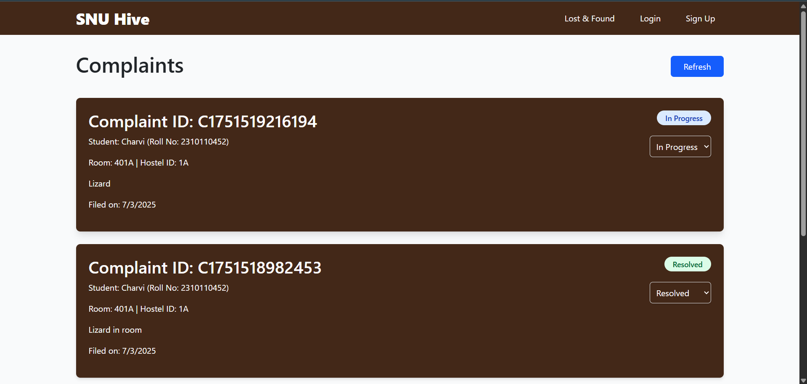

SNU Hive – Hostel Management System for Shiv Nadar University

SNU Hive is a full-stack web application designed to streamline hostel management and support services at Shiv Nadar University. It brings together students, wardens, and support staff onto a single platform to improve efficiency and communication—eliminating the need for outdated systems like excessive emails and WhatsApp forwards.

Live Demo - https://snu-hivefrontend.onrender.com/

User Roles

- Student: Signs up with their SNU email + a password (matched against records the warden has uploaded), logs complaints, raises food requests, reports/views lost items, and posts or joins carpools.
- Warden: Bulk-uploads/updates official student records via CSV, approves/rejects food requests and carpool join requests for their hostel's students.
- Support Admin: Handles complaints based on their department (e.g., maintenance, security).

Features

1. 🎓 Warden-Verified Student Onboarding
- Wardens bulk-upload a CSV of official student records (roll number, room, hostel, contact info, etc.) — this is the source of truth, not self-reported data.
- Students activate their account by signing up with just their email + a password (or via Google Sign-In), matched against the warden's uploaded record.

2. 🛠 Complaint Management
- Students can log complaints under categories like maintenance, Wi-Fi, cleaning, etc.
- Support admins see only the complaints relevant to their department.
- Status tracking for raised issues.

3. 🍱 Food Request System
- Sick students can request meals from the mess, attaching a prescription (image or PDF) for the warden to review.
- Requests are routed to the warden for approval or rejection.
- Request history is maintained.

4. 📦 Lost and Found
- Students can report lost or found items with images and descriptions.
- Public board for browsing and claiming items.

5. 🚗 Carpooling
- Students can post a ride (route, date/time, seats) with Google Places-autocompleted locations.
- Other students browse and filter available rides by date, place, or time, and request to join.
- Ride creators approve/reject join requests; approved riders get the creator's contact info.
- Per-ride chat between the creator and anyone who's requested to join (even before approval).

Tech Stack

| Layer           | Technology                         |
|----------------|-------------------------------------|
| **Frontend**    | React.js + Vite                    |
| **Backend**     | Node.js, Express.js                |
| **Database**    | MongoDB (Mongoose)                 |
| **Authentication** | JWT (JSON Web Tokens) + Google OAuth |
| **Image/File Uploads** | Cloudinary                   |
| **Maps**        | Google Places API (carpool location autocomplete) |

Prerequisites

- Node.js and npm
- A MongoDB Atlas cluster (or local MongoDB instance)
- Git

1. Clone the repository
```bash
git clone https://github.com/Charvi426/SNU_HIVE.git
cd SNU_HIVE
```
2. Backend Setup
```
cd backend
npm install
```

Create a `.env` file in `backend/` and configure:

```
PORT=5000
MONGO_URI=mongodb+srv://<username>:<password>@<cluster>/?retryWrites=true&w=majority
JWT_SECRET=some_long_random_string

CLOUDINARY_CLOUD_NAME=your_cloud_name
CLOUDINARY_API_KEY=your_api_key
CLOUDINARY_API_SECRET=your_api_secret

GOOGLE_CLIENT_ID=your_google_oauth_client_id
GOOGLE_CLIENT_SECRET=your_google_oauth_client_secret
GOOGLE_CALLBACK_URL=http://localhost:5000/auth/google/callback

FRONTEND_URL=http://localhost:5173
```

Start the backend:
```
node backend.js
```

3. Frontend Setup
```
cd frontend
npm install
```

Create a `.env` file in `frontend/` and configure:

```
VITE_API_URL=http://localhost:5000
VITE_GOOGLE_MAPS_API_KEY=your_google_maps_api_key
```

Start the frontend:
```
npm run dev
```
Screenshots








Future Plans
Here are some features we are planning to add in upcoming versions:

🔐 Forgot Password Feature:
To help users securely reset their passwords.

🔔 Notifications:
Real-time alerts for status updates, approvals, and more.

🧺 Washing Machine Slot Booking:
Students will be able to book slots to use washing machines in their hostels.
